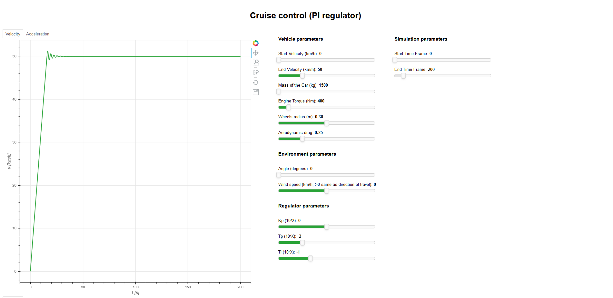
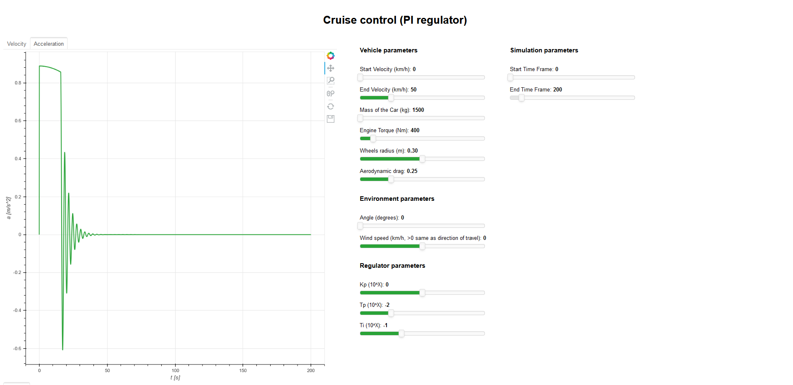
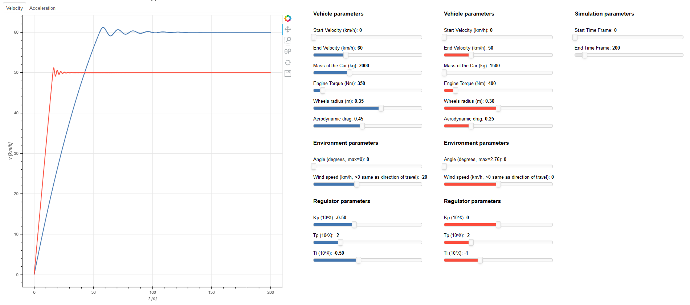
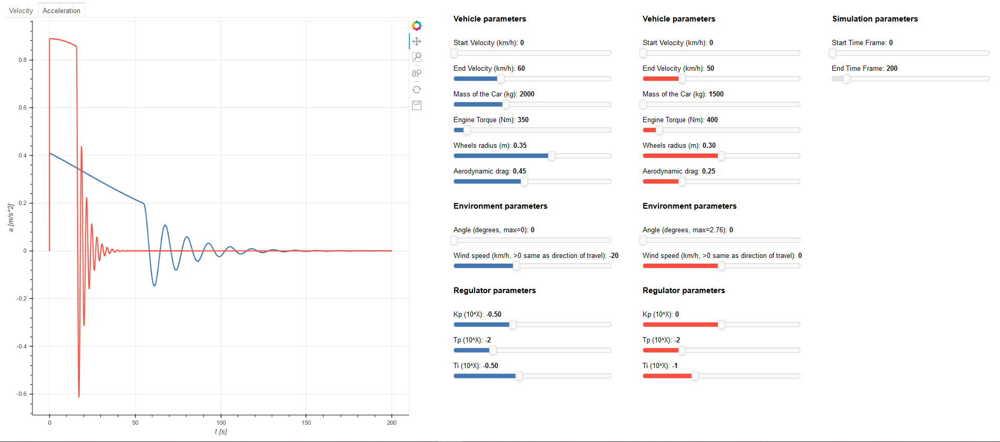

# PP-3-PA-project
Group project aiming to implement PI regulator into cruise control system.  
Program uses [Bokeh](https://bokeh.org/) library for data visualization. 

### Analyzing change of velocity depending on the parameters of the car and the environment 

### Analyzing  change of acceleration depending on the parameters of the car and the environment

### Compering velocity changes for different parameters

### Compering acceleration changes for different parameters
